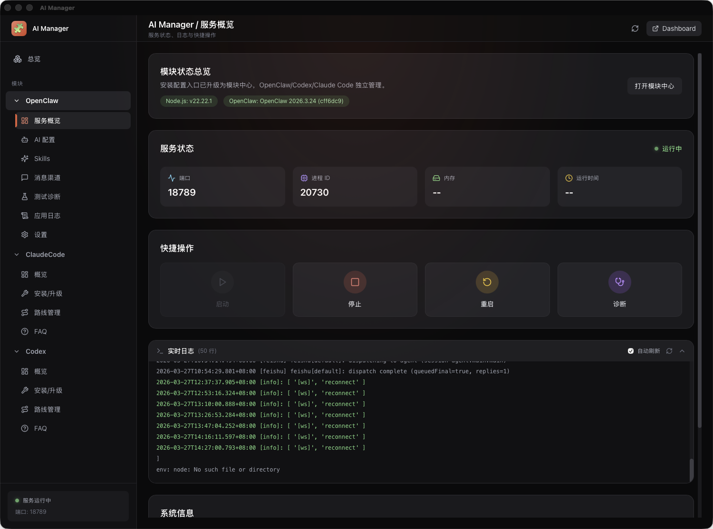
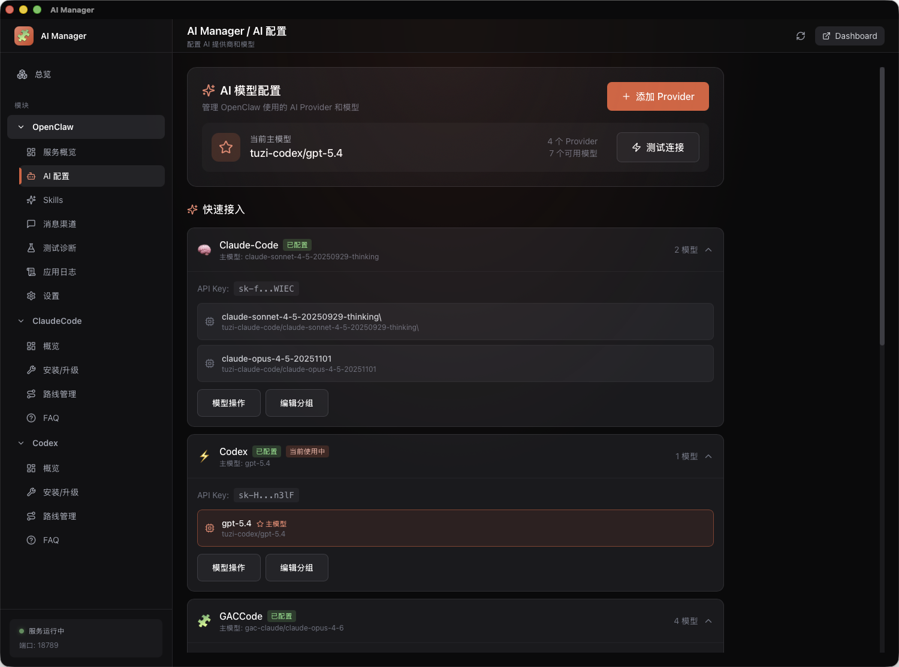
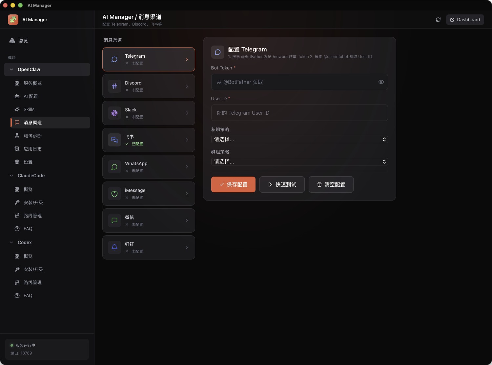
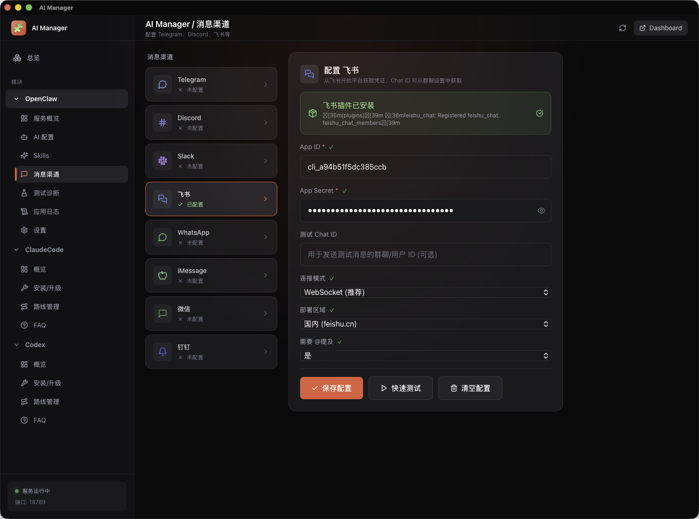

# 🧩 AI Manager

AI Manager 是一款跨平台桌面控制台，面向使用 OpenClaw CLI 与 Tuzi API 的用户，用来统一管理 AI 模型、消息渠道和本地服务运行状态，并集成 Claude Code、Codex 等模块。

基于 **Tauri 2.0 + React + TypeScript + Rust** 构建，当前版本重点优化了 **Tuzi API 快速接入体验**，同时保留多 Provider 配置、日志诊断和服务控制能力，适合希望在桌面端完成部署、调试和日常运维的用户。


## 🎯 适合谁用

- 希望快速接入 **Tuzi API**，减少手动填写和调试成本的用户
- 同时管理多个 AI Provider、多个模型和多个消息渠道的用户
- 需要在桌面端直接查看服务状态、日志和诊断结果的用户
- 不想频繁切换命令行、配置文件和浏览器后台的用户

## ✅ 你可以用它做什么

- 在一个界面里完成 **模型配置、渠道接入、服务启动和问题排查**
- 快速切换主模型，兼容 OpenAI 格式 API 和第三方服务
- 查看 OpenClaw 服务运行状态、日志输出和连通性测试结果
- 把 Telegram、飞书等消息渠道接入到同一个桌面工作流里

## ⚡ 快速开始

1. 从 [Releases](https://github.com/tuziapi/openclaw-manager/releases/) 下载适合你平台的安装包
2. 打开应用后，优先在 **AI 配置** 中接入 Tuzi API 或其他 Provider
3. 根据需要继续配置消息渠道，并在仪表盘中完成启动、重启和诊断

> 如果你是第一次使用，建议先完成 **AI 配置 → 渠道配置 → 服务测试** 这条路径，再进入日常使用。

## 📸 界面预览

### 📊 仪表盘概览

实时监控服务状态，一键管理 AI 助手服务。



- 服务状态实时监控（端口、进程 ID、内存、运行时间）
- 快捷操作：启动 / 停止 / 重启 / 诊断
- 实时日志查看，支持自动刷新

---

### 🤖 AI 模型配置

灵活配置多个 AI 提供商，一键接入 Tuzi API，支持自定义 API 地址。
- [获取 Tuzi API Key](https://api.tu-zi.com/token)
- [视频教程](https://www.bilibili.com/video/BV1k4PqzPEKz/)



- 支持 14+ AI 提供商（Anthropic、OpenAI、DeepSeek、Moonshot、Gemini 等）
- 自定义 API 端点，兼容 OpenAI 格式的第三方服务
- 一键设置主模型，快速切换

---

### 📱 消息渠道配置

连接多种即时通讯平台，打造全渠道 AI 助手。

<table>
  <tr>
    <td width="50%">
      
      <p align="center"><b>Telegram Bot</b></p>
    </td>
    <td width="50%">
      
      <p align="center"><b>飞书机器人</b></p>
    </td>
  </tr>
</table>

- **Telegram** - Bot Token 配置、私聊/群组策略
- **飞书** - App ID/Secret、WebSocket 连接、多部署区域
- **更多渠道** - Discord、Slack、WhatsApp、iMessage、微信、钉钉

---

## ✨ 功能特性

AI Manager 不是单纯的“配置面板”，而是把模型接入、渠道配置、服务控制和故障排查集中到一个应用里，减少命令行和多配置文件来回切换的成本。

| 模块 | 功能 |
|------|------|
| 📊 **仪表盘** | 实时服务状态监控、进程内存统计、一键启动/停止/重启 |
| 🤖 **AI 配置** | Tuzi API 一键接入、14+ AI 提供商、自定义 API 地址、模型快速切换 |
| 📱 **消息渠道** | Telegram、Discord、Slack、飞书、微信、iMessage、钉钉 |
| ⚡ **服务管理** | 后台服务控制、实时日志、开机自启 |
| 🧪 **测试诊断** | 系统环境检查、AI 连接测试、渠道连通性测试 |

## 🍎 macOS 常见问题

### "已损坏，无法打开" 错误

macOS 的 Gatekeeper 安全机制可能会阻止运行未签名的应用。解决方法：

**方法一：移除隔离属性（推荐）**

```bash
# 对 .app 文件执行
xattr -cr "/Applications/AI Manager.app"

# 或者对 .dmg 文件执行（安装前）
xattr -cr ~/Downloads/AI-Manager.dmg
```

**方法二：通过系统偏好设置允许**

1. 打开 **系统偏好设置** > **隐私与安全性**
2. 在 "安全性" 部分找到被阻止的应用
3. 点击 **仍要打开**

**方法三：临时禁用 Gatekeeper（不推荐）**

```bash
# 禁用（需要管理员密码）
sudo spctl --master-disable

# 安装完成后重新启用
sudo spctl --master-enable
```

### 权限问题

如果应用无法正常访问文件或执行操作：

**授予完全磁盘访问权限**

1. 打开 **系统偏好设置** > **隐私与安全性** > **完全磁盘访问权限**
2. 点击锁图标解锁，添加 **AI Manager**

**重置权限**

如果权限设置出现异常，可以尝试重置：

```bash
# 重置辅助功能权限数据库
sudo tccutil reset Accessibility

# 重置完全磁盘访问权限
sudo tccutil reset SystemPolicyAllFiles
```

## 📥 下载安装

普通用户无需准备开发环境，直接下载对应平台的安装包即可使用：

👉 [前往 Releases 页面下载](https://github.com/tuziapi/openclaw-manager/releases/)

| 平台 | 安装包 | 说明 |
|------|--------|------|
| macOS (Universal) | `AI Manager_x.x.x_universal.dmg` 或同类通用 `.dmg` 文件 | 同时支持 Apple Silicon 和 Intel Mac，双击 .dmg 拖入 Applications |
| Windows | `AI Manager_x.x.x_x64-setup.exe` | 双击运行安装向导 |
| Windows (MSI) | `AI Manager_x.x.x_x64_zh-CN.msi` | 适合企业部署或静默安装 |
| Linux (Debian/Ubuntu) | `ai-manager_x.x.x_amd64.deb` | `sudo dpkg -i xxx.deb` |
| Linux (通用) | `ai-manager_x.x.x_amd64.AppImage` | 添加执行权限后直接运行 |

> **从旧版 OpenClaw Manager 升级**：应用包标识已改为 `com.tuziapi.ai-manager`，系统会将其视为新应用，无法直接覆盖安装；请按需卸载旧版后再安装 AI Manager。

> **macOS 用户注意**：首次打开可能提示"已损坏，无法打开"，这是 Gatekeeper 安全机制导致的，参见下方 [macOS 常见问题](#-macos-常见问题) 解决。

---

## 🚀 从源码构建（开发者）

如果你需要参与开发或自行编译，请按以下步骤操作。

### 环境要求

- **Node.js** >= 18.0
- **Rust** >= 1.70
- **pnpm** (推荐) 或 npm

### macOS 额外依赖

```bash
xcode-select --install
```

### Windows 额外依赖

- [Microsoft C++ Build Tools](https://visualstudio.microsoft.com/visual-cpp-build-tools/)
- [WebView2](https://developer.microsoft.com/en-us/microsoft-edge/webview2/)

### Linux 额外依赖

```bash
# Ubuntu/Debian
sudo apt update
sudo apt install libwebkit2gtk-4.1-dev build-essential curl wget file libxdo-dev libssl-dev libayatana-appindicator3-dev librsvg2-dev

# Fedora
sudo dnf install webkit2gtk4.1-devel openssl-devel curl wget file libxdo-devel
```

### 安装与运行

```bash
# 克隆项目
git clone https://github.com/tuziapi/openclaw-manager.git
cd openclaw-manager   # 仓库目录名仍为 openclaw-manager，直至远端改名

# 安装依赖
npm install

# 开发模式运行
npm run tauri:dev

# 构建发布版本
npm run tauri:build
```

## 📁 项目结构

```
openclaw-manager/            # 本地克隆目录名（可与仓库一致）
├── src-tauri/                 # Rust 后端
│   ├── src/
│   │   ├── main.rs            # 入口
│   │   ├── commands/          # Tauri Commands
│   │   │   ├── service.rs     # 服务管理
│   │   │   ├── config.rs      # 配置管理
│   │   │   ├── process.rs     # 进程管理
│   │   │   └── diagnostics.rs # 诊断功能
│   │   ├── models/            # 数据模型
│   │   └── utils/             # 工具函数
│   ├── Cargo.toml
│   └── tauri.conf.json
│
├── src/                       # React 前端
│   ├── App.tsx
│   ├── components/
│   │   ├── Layout/            # 布局组件
│   │   ├── Dashboard/         # 仪表盘
│   │   ├── AIConfig/          # AI 配置
│   │   ├── Channels/          # 渠道配置
│   │   ├── Service/           # 服务管理
│   │   ├── Testing/           # 测试诊断
│   │   └── Settings/          # 设置
│   └── styles/
│       └── globals.css
│
├── package.json
├── vite.config.ts
└── tailwind.config.js
```

## 🛠️ 技术栈

| 层级 | 技术 | 说明 |
|------|------|------|
| 前端框架 | React 18 | 用户界面 |
| 状态管理 | Zustand | 轻量级状态管理 |
| 样式 | TailwindCSS | 原子化 CSS |
| 动画 | Framer Motion | 流畅动画 |
| 图标 | Lucide React | 精美图标 |
| 后端 | Rust | 高性能系统调用 |
| 跨平台 | Tauri 2.0 | 原生应用封装 |

## 📦 构建产物

运行 `npm run tauri:build` 后，产物位于 `src-tauri/target/release/bundle/`。CI 推送 `v*` 标签后会自动构建并创建 GitHub Draft Release。

## 🎨 设计理念

- **暗色主题**：护眼舒适，适合长时间使用
- **现代 UI**：毛玻璃效果、流畅动画
- **响应式**：适配不同屏幕尺寸
- **高性能**：Rust 后端，极低内存占用

## 🔧 开发命令

```bash
# 开发模式（热重载）
npm run tauri:dev

# 仅运行前端
npm run dev

# 构建前端
npm run build

# 构建完整应用
npm run tauri:build

# 检查 Rust 代码
cd src-tauri && cargo check

# 运行 Rust 测试
cd src-tauri && cargo test
```

## 📝 配置说明

### Tauri 配置 (tauri.conf.json)

- `app.windows` - 窗口配置
- `bundle` - 打包配置
- `plugins.shell.scope` - Shell 命令白名单
- `plugins.fs.scope` - 文件访问白名单

### 环境变量

应用会读取 `~/.openclaw/env` 中的环境变量配置。

## 🤝 贡献指南

1. Fork 项目
2. 创建功能分支 (`git checkout -b feature/amazing-feature`)
3. 提交更改 (`git commit -m 'Add amazing feature'`)
4. 推送到分支 (`git push origin feature/amazing-feature`)
5. 创建 Pull Request

## 📄 许可证

MIT License - 详见 [LICENSE](LICENSE)

## 🔗 相关链接

- [AI Manager](https://github.com/tuziapi/openclaw-manager) - 图形界面版本（本项目）
- [OpenClawInstaller](https://github.com/cwj526/OpenClawInstaller) - 命令行版本
- [Releases 下载](https://github.com/tuziapi/openclaw-manager/releases/) - 安装包下载
- [Tauri 官方文档](https://tauri.app/)
- [React 官方文档](https://react.dev/)

---

**Made with ❤️ by Tuzi API**
